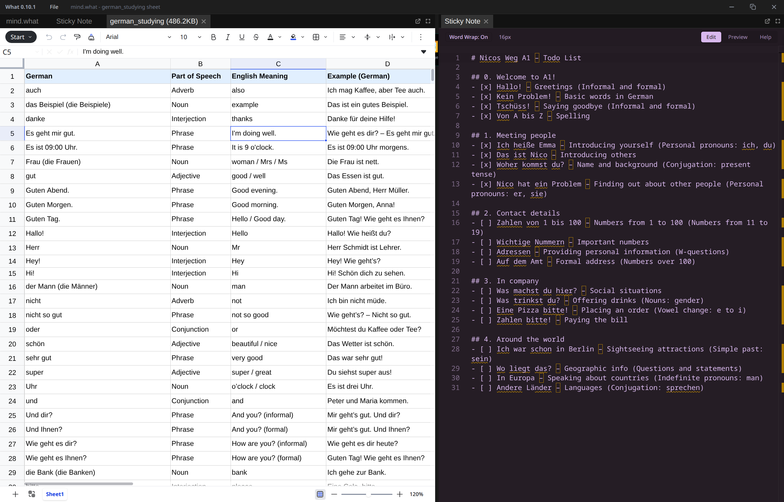
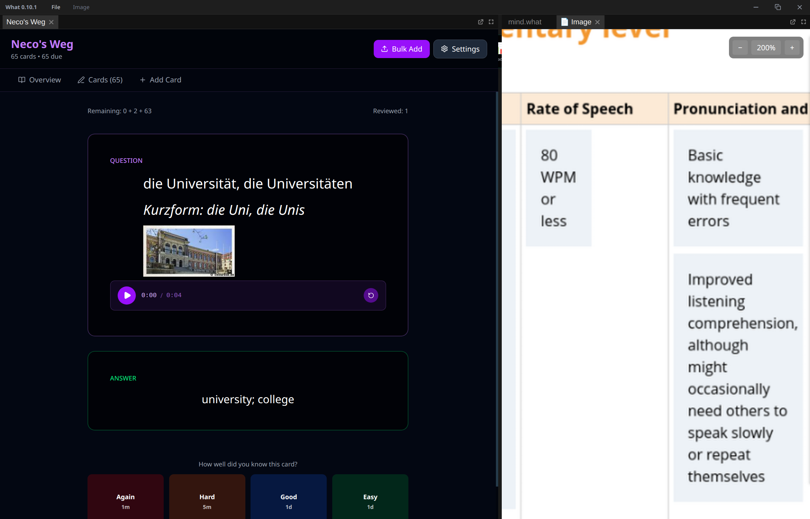

# What - The Visual Thinking Canvas

Imagine if VS Code, Photoshop, Figma, Anki, and XMind had a baby—but this baby is 100x better for your mind. That's **"What"**.







**"What"** is a powerful, local-first visual thinking application designed to be your personal digital whiteboard and mind-mapping tool. Whether you're sketching a new idea, organizing complex thoughts, or creating a visual project plan, "What" provides an infinite canvas to bring your ideas to life. All your work is saved securely on your device in a single, portable `.what` file.


## Features

- **Infinite Canvas:** Never run out of space. Pan, zoom, and sketch freely.
- **Local-First:** Your data is yours. Everything is stored locally, ensuring privacy and offline access.
- **Rich Content:** Embed images, videos, links, and text notes directly onto the canvas.
- **Custom File Format:** The `.what` file is a self-contained archive with your SQLite database, assets, and metadata.
- **Cross-Platform:** Works seamlessly on Windows, macOS, and Linux.
- **Powerful Widgets:** Use sticky notes, arrows, shapes, and more to structure your thoughts.


## Download & Installation

You can download the latest version of "What" for your operating system from our official **[GitHub Releases](https://github.com/AhmedHodiani/what/releases)** page.

1.  Go to the **[Releases](https://github.com/AhmedHodiani/what/releases)** page.
2.  Find the latest release.
3.  Download the appropriate file for your system (`.exe` for Windows, `.dmg` for macOS, `.AppImage` or `.deb` for Linux).
4.  Run the installer or the application file.

## 🛠️ Quick Start for Developers

If you want to contribute or run the app from the source code:

```bash
# 1. Clone the repository
git clone https://github.com/AhmedHodiani/what.git
cd what

# 2. Install dependencies
pnpm install

# 3. Run the development server
pnpm dev
```

## File Format

A `.what` file is a custom container that includes:

-   `main.db` — The SQLite database for all your objects and metadata.
-   `/assets/` — A folder containing all raw images, videos, and other media you've added to the canvas.
-   `meta.json` — A small file with versioning information and canvas metadata.